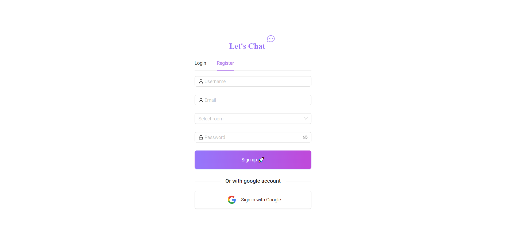
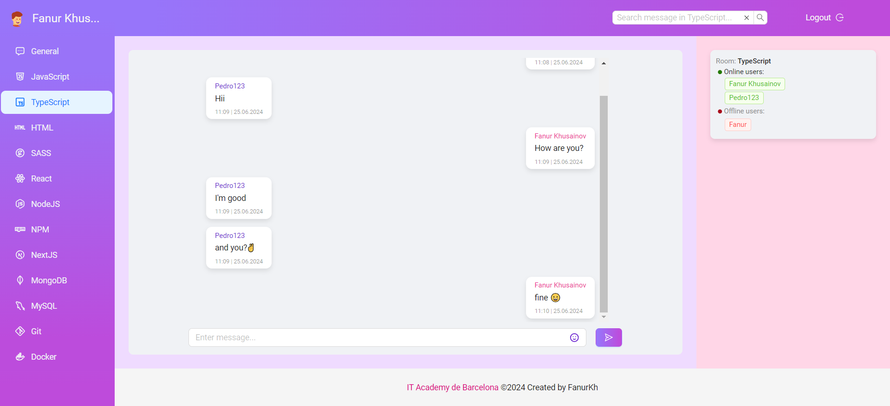

# The Chat Full-Stack Application

This is a simple full-stack chat application for educational purposes. It uses Socket.io for real-time messaging, React with Ant Design for the frontend, and Node.js with Express for the backend. Users can sign in, join/change chat rooms, and message other users in real time.

## Technologies


## Features

- **Multiple Chat Rooms**: Users can create and join multiple chat rooms.
- **Real-Time Communication**: Built with Socket.io for real-time interaction.
- **User Authentication**: Implements Google OAuth 2 for secure access.
- **Persistence**: Chat history and user data are stored using MongoDB with Mongoose.
- **Advanced Features**: Includes user signup and logout, a search field for chat messages, real-time online/offline status, and more.

> [!NOTE]
> ### Level ⭐️
>
> ✅ Create an application that displays a login page where the user can enter a chat room. By opening the same URL in another browser window, we can log in with another user. Verify that they are in the same room and allow them to chat.<br> 
> ✅ Add the ability to create multiple chat rooms and manage persistence with MongoDB (with Mongoose).
>
> ### Level ⭐️⭐️
>
> ✅ Add authentication using Google Token (google-auth-library).
>
> ### Level ⭐️⭐️⭐️
>
> ✅ **Additional features:**
>
> ⚡️ SingUp of users to create a user and access chat rooms.<br>
> ⚡️ User logout to log out of chat rooms.<br>
> ⚡️ Search field to search for chat messages.<br>
> ⚡️ List of users in chat room (online/offline).<br>
> ⚡️ Indicator of connected users in the chat room.<br>
> ⚡️ Possibility to choose a room.<br>
>
> ✅ Use of TypeScript for the development of the project.<br>
> ✅ Use of React for client development.<br>
> ✅ Use of Ant Design for design development.<br>

## Getting Started

### `Prerequisites`

- [Node.js](https://nodejs.org/en/download/package-manager) installed
- MongoDB running on your local machine or remotely

### `Installation`

1. Clone the repository:
```bash
git clone https://github.com/Fanur1991/IT-Academy-sprint_7-Chat-Socket.io-TS-Nodejs-Mongo-React-Antd
```
```bash
cd IT-Academy-sprint_7-Chat-Socket.io-TS-Nodejs-Mongo-React-Antd
```

### `Install Dependencies`

2. Install all dependencies
```bash
cd client
npm install
cd ../server
npm install
```

### `Run Server and Client`

3. To run simultaneously server and client apps
```bash
cd server 
```
```bash
npm run start
```

## Frontend

A frontend is developed to interact with the backend, providing a user-friendly interface for chat between users.

### Login page:



### Home page:



## License

This project is distributed under the Apache 2.0 license.

---

Developed by [Fanur Khusainov](https://www.linkedin.com/in/fanur-khusainov-ab86b2102/) with ❤️ and ☕.
